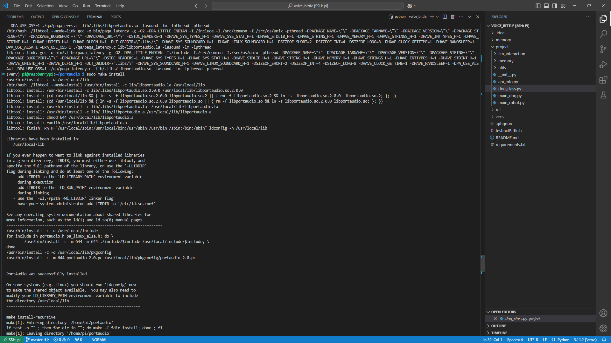
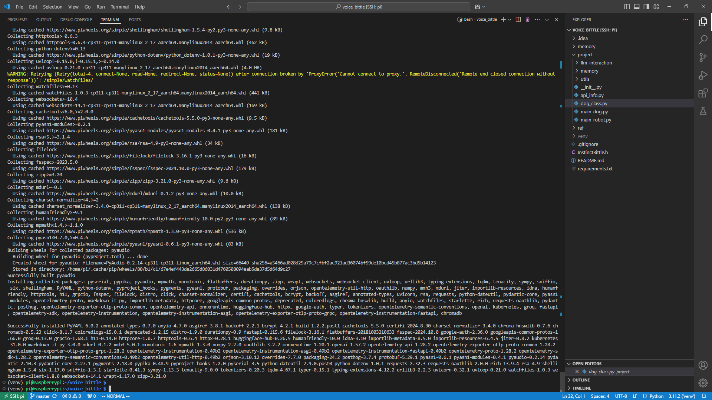
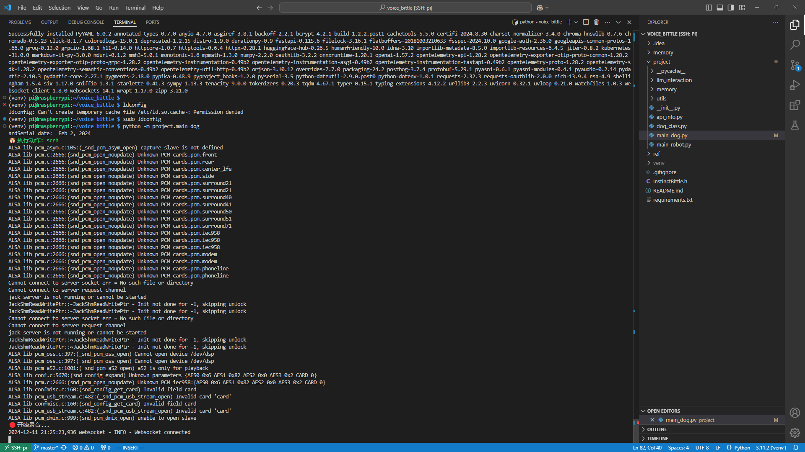

# 树莓派部署教程

本教程记录了从零开始在树莓派上部署本项目的过程。

## 前置准备

1. 安装系统
    - 跟随官方教程安装树莓派系统PI OS（本教程可全程使用SSH完成，可使用light OS版本，只是注意需要使用有线网络或是先在系统镜像中设置初始网络连接）
    - 配置网络连接

2. 代理设置
    - 配置网络代理可以极大地方便后续的部署安装过程，安装时需要连接GitHub和PyPI服务器。此外，如果需要使用openai API，配置代理是必要的。
    - PI OS 无法直接安装GUI版本的clash（至少当前的clash verge linux版本不行），且缺少的依赖较多，建议直接运行clash内核。目前正在维护的主流内核是[mihomo](https://github.com/MetaCubeX/mihomo)。使用ssh配置并运行mihomo的方法可参考[此文档](https://lng205.github.io/posts/clashcli/)。

3. apt换源
    - PI OS基于debian构建，使用apt作为包管理器，可以直接将apt源修改为国内源（如[清华源](https://mirrors.tuna.tsinghua.edu.cn/help/raspberrypi/)）。
    - 换源后建议运行`sudo apt update; sudo apt upgrade -y`更新软件。

## 部署voice_bittle

1. 下载项目`git clone https://github.com/echoandzoey/voice_bittle`
2. 创建虚拟环境`python -m venv venv; source venv/bin/activate`
3. 安装依赖`pip install -r requirements.txt`

此时由于缺少`portaudio`库，会遇到`pyaudio`安装失败的问题。
PI OS的apt源里没有`portaudio`库，需要手动从源码编译安装。

### 安装portaudio

1. 安装依赖`sudo apt install libasound-dev`
2. 下载[源码](https://files.portaudio.com/download.html)`wget https://files.portaudio.com/archives/pa_stable_v190700_20210406.tgz`
3. 解压`tar -zxvf pa_stable_v190700_20210406.tgz`
4. 编译安装
    ```shell
    cd portaudio
    ./configure && make
    sudo make install
    ```



### 安装pyaudio

安装完`portaudio`后，再次运行`pip install pyaudio`即可成功安装`pyaudio`库。

1. 安装依赖`sudo apt install python3-dev`
2. 安装`pyaudio`库`pip install pyaudio`



之后可以运行项目了（[ALSA报错](https://github.com/PortAudio/portaudio/wiki/Platforms_RaspberryPi)可以忽略）。

